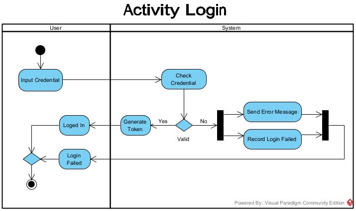
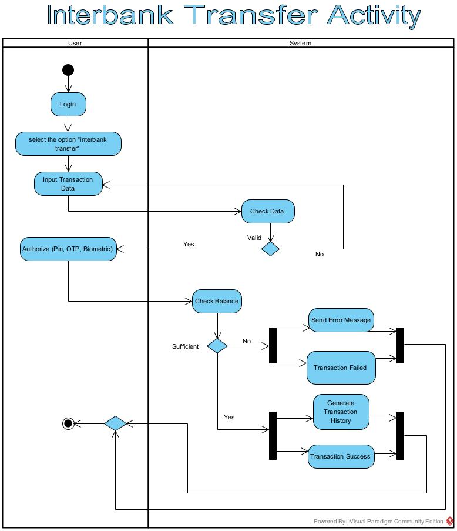

[](https://classroom.github.com/a/OEA-wQat)


# RevouBank
RevouBank adalah bank baru yang didirikan yang bertujuan untuk menyediakan layanan perbankan yang lancar dan aman melalui aplikasi berbasis web. Aplikasi ini masih pada tahap perencanaan dan akan dikembangkan setelah perencanaan selesai.

## Activity Diagram
Di bawah ini merupakan activity diagram dari aplikasi RevouBank

### 1. Login

Diagram ini untuk menampilkan alur login oleh user. Dari Activity di atas, user memasukkan data credential seperti email dan password lalu data tersebut akan di validai oleh sistem. Jika data valid maka token akan dibuat dan user berhasil login ke dalam aplikasi. Jika data tidak valid, sistem akan memberi pesan error dan login gagal.

### 2. Transfer

Diagram ini untuk menampilkan alur transfer antar bank oleh user. Dari Activity di atas, user melakukan login terlebih dahulu lalu pilih opsi "Interbank Transfer". setelah memasukkan data credential dan data tersebut akan di validasi oleh sistem jika data tidak valid maka user memasukkan ulang data nya dan jika data valid user akan meng-otorisasi pembayaran dan akan dicek saldo dana nya. jika saldo dana cukup maka dana yang dikirim oleh user akan masuk ke rekening penerima dan jika dana nya tidak cukup makan transfer gagal.


## 🛠 **Installation & Setup**

### **1. Clone Repository**

```sh
git clone https://github.com/revou-fsse-oct24/milestone-3-ridwanam9.git
cd milestone-3-ridwanam9.git
```

### **2. Add Flask**


```sh
uv add flask
```
Also add flask_jwt_extended if needed

```sh
uv add flask_jwt_extended
```

### **3. Run Project**

```sh
uv run main.py
```
Or

```sh
flask --app main run
```

## 🛠 **API Requests and Response**

### User Management
- `POST /users` - Create a new user
- `POST /login` - User login
- `GET /users/me` - Retrieve current user profile
- `PUT /users/me` - Update current user profile
- `Get /users` - Retrieve all users by admin

### Account Management
- `GET /accounts` - Retrieve account for current user


### Transaction Management
- `POST /transactions` - Create a new transaction (deposit, withdrawal)
- `GET /transactions/history` - Retrieve all transactions history from spesific user

## Usage Examples

### Create a user

```bash
curl -X POST http://127.0.0.1:5000/users/ \
  -H "Content-Type: application/json" \
  -d '{
    "username": "Ridwan",
    "password": "ridwan123"
  }'
```
### Response

```sh
{
  "msg": "User created successfully",
  "user_id": 3
}
```